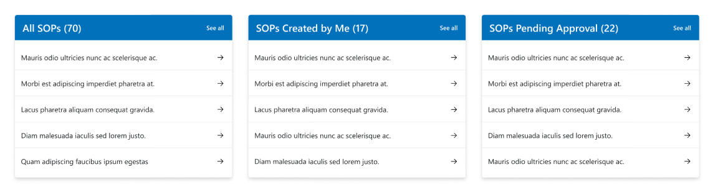
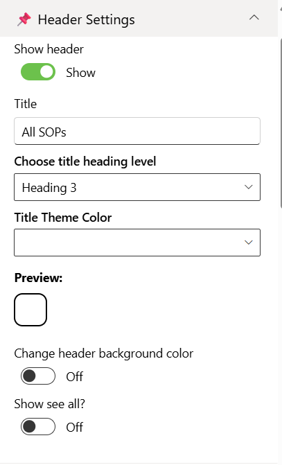
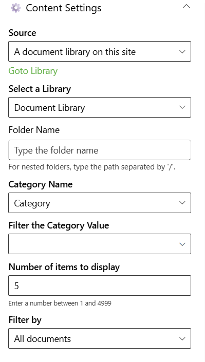
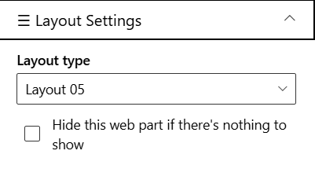
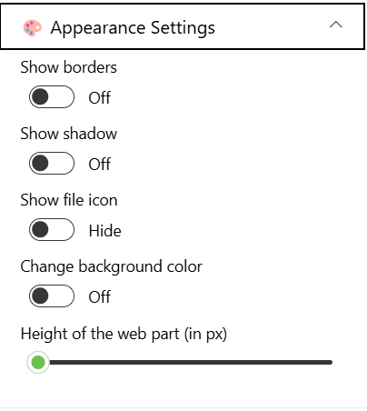

## Overview

Document Library allows users to browse and interact with SharePoint documents directly on a page. It can be configured to target a specific document library or dynamically aggregate files from all libraries within the current site. Ideal for scenarios where quick access to files across multiple libraries is needed, it supports modern SharePoint pages and provides a responsive, user-friendly interface for document management.

## Configuration

### Header Settings

📸 View Header Settings Screenshots

| Name                           | Purpose                                                             | Example / Options   |
| ------------------------------ | ------------------------------------------------------------------- | ------------------- |
| Show header                    | Toggle to show or hide the Web Part title.                          | Show / Hide         |
| Title                          | Specify a title for the Document Library Web Part.                  | “DOCUMENT CONTENTS” |
| Choose title heading level     | Select the heading level (H1–H6) for the Web Part title.            | Heading 3           |
| Title theme color              | Set a theme-based title color or style for the Web Part.            | Dropdown            |
| Change header background color | Set a background color of title  for the Web Part.                  | Color Picker        |
| Show see all button            | Display or hide the “See All” link for Document Library navigation. | Show / Hide         |

- - -

### Content Settings

📸 View Content Settings Screenshots

| Name                       | Purpose                                                               | Example / Options          |
| -------------------------- | --------------------------------------------------------------------- | -------------------------- |
| Source                     | Source of the Document library                                        | Dropdown                   |
| Select Libraries           | Select the Document Library                                           | Dropdown                   |
| Folder Name                | For nested folders, type the path separated by '/'                    | Text                       |
| Category Name              | Select the Category Choice column                                     | Dropdown                   |
| Filter the Category Value  | Select the Category Choice column Value to display specific documents | Dropdown                   |
| Number of items to display | Enter the number of items to display                                  | Number between 01 and 4999 |

- - -

#### Layout Settings

📸 View layout Configuration Screenshots

| Name          | Purpose                                            | Example  |
| ------------- | -------------------------------------------------- | -------- |
| Choose layout | Choose the layout for the Document Library Webpart | Dropdown |

- - -

### Appearance Settings

📸 View Appearance Settings Screenshots

| Name                    | Purpose                                                             | Example / Options |     |
| ----------------------- | ------------------------------------------------------------------- | ----------------- | --- |
| Show border             | Toggle to show or hide the border of the document content.          | On/Off            |     |
| Show shadow             | Toggle to show or hide the shadow of the document content.          | On/Off            |     |
| Show file icon          | Toggle to show or hide the File icon of the document content.       | On/Off            |     |
| Change background color | Toggle to change background color the document container.           | On/Off            |     |
| Enable navigation       | Toggle to show or hide the slider navigation icon document content. | On/Off            |     |
