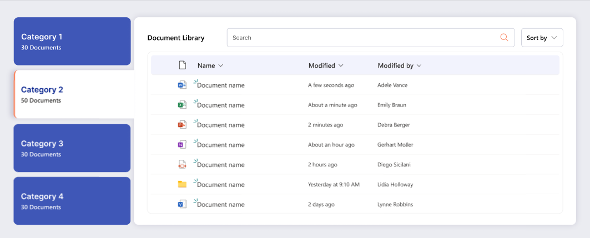
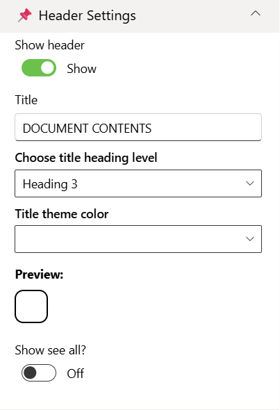
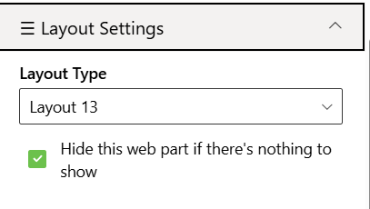
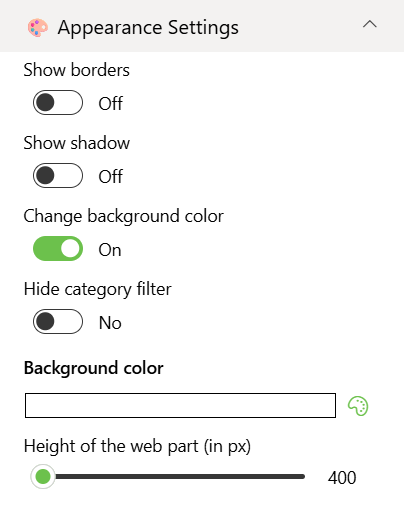

## Overview

Document Library allows users to browse and interact with SharePoint documents directly on a page. It can be configured to target a specific document library or dynamically aggregate files from all libraries within the current site. Ideal for scenarios where quick access to files across multiple libraries is needed, it supports modern SharePoint pages and provides a responsive, user-friendly interface for document management.

## Installation

### Step 1: Upload the .sppkg File to App Catalog

1. Navigate to your **SharePoint Admin Center**.
2. In the left navigation, select **More features**.
3. Under **Apps**, select **Open**.
4. Click on **App Catalog**. If you don't have an App Catalog, you'll need to create one first.
5. Select **Apps for SharePoint** from the left navigation.
6. Click **Upload** or drag and drop your `spd-document-library-13.sppkg` file into the App Catalog.
7. A dialog will appear asking you to trust and deploy the app. Check the box **Make this solution available to all sites in the organization** if you want it available tenant-wide.
8. Click **Deploy**.

### Step 2: Add the App to Your Site

1. Navigate to the SharePoint site where you want to use the Document Library Web Part.
2. Click the **Settings** gear icon (⚙️) in the top right corner.
3. Select **Add an app** (or **Site contents** > **New** > **App**).
4. Search for your Document Library app by name **Document Library 13 by SharePoint Designs**.
5. Click on the app to add it to your site.
6. Wait for the app to be installed (this may take a few moments).

### Step 3: Add the Web Part to a Page

1. Navigate to the page where you want to add the Document Library Web Part.
2. If you're on a modern page, click **Edit** in the top right.
3. Click the **+** icon where you want to add the web part.
4. Search for **Document Library** in the web part picker.
5. Select the **Document Library Web Part** to add it to your page.
6. The web part will be added and you can now proceed with configuration.

---

## Configuration

### Header Settings

📸 View Header Settings Screenshots

| Name                       | Purpose                                                             | Example / Options   |
| -------------------------- | ------------------------------------------------------------------- | ------------------- |
| Show header                | Toggle to show or hide the Web Part title.                          | Show / Hide         |
| Title                      | Specify a title for the Document Library Web Part.                  | “DOCUMENT CONTENTS” |
| Choose title heading level | Choose the heading level for the webpart title.                                                          | H1 / H2 / H3 / Custom             |
| Custom font size for title | Specify a custom font size for the webpart title (only visible when “Custom” heading level is selected). | 24px   
| Title theme color          | Set a theme-based title color or style for the Web Part.            | Dropdown            |
| Show see all button        | Display or hide the “See All” link for Document Library navigation. | Show / Hide         |

- - -

### Content Settings

📸 View Content Settings Screenshots

| Name                       | Purpose                                                      | Example / Options                         |
| -------------------------- | ------------------------------------------------------------ | ----------------------------------------- |
| Source                     | Source of the Document library                               | Dropdown                                  |
| Select Libraries           | Select the Document Library                                  | Checkbox                                  |
| Search sites               | Search the SharePoint sites available in the tenant          | SharePoint Sites available in the tenant. |
| Website(s) selected        | Select the SharePoint sites source for the Document Library. | Search results based upon the key search  |
| Number of items to display | Enter the number of items to display                         | Number between 01 and 4999                |

- - -

#### Layout Settings

📸 View layout Configuration Screenshots

| Name          | Purpose                                            | Example  |
| ------------- | -------------------------------------------------- | -------- |
| Choose layout | Choose the layout for the Document Library Webpart | Dropdown |

- - -

### Appearance Settings

📸 View Appearance Settings Screenshots

| Name                           | Purpose                                                            | Example / Options |     |
| ------------------------------ | ------------------------------------------------------------------ | ----------------- | --- |
| Show border                    | Toggle to show or hide the border of the document content.         | On/Off            |     |
| Show shadow                    | Toggle to show or hide the shadow of the document content.         | On/Off            |     |
| Change background color        | Toggle to change background color the document container.          | On/Off            |     |
| Hide category filter           | Toggle to show or hide the Category filter of the document content | On/Off            |     |
| Background color               | Select the container background color from the color picker.       | Color Picker      |     |
| Height of the web part (in px) | Set the custom desire height of the Document Content Web part.     | Slider            |     |
