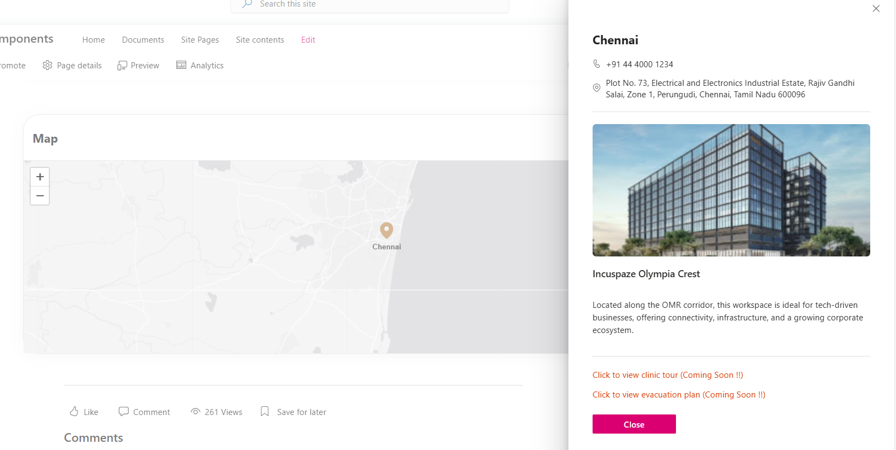
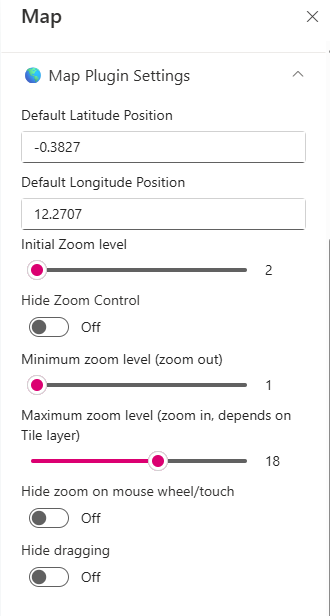
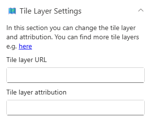

## Overview

The **Map Web Part** is a custom-built solution that helps you display multiple locations in an interactive and engaging way within SharePoint. It uses latitude and longitude to accurately plot locations on a dynamic map. Each location can include details like an image, full address, contact information, and a tour URL for a virtual experience. Overall, it transforms simple location data into a powerful visual tool, making it easier for users to explore and connect with locations directly from the intranet.

## Configuration

### Header Settings

📸 View Header Settings Screenshots

| Name                     | Purpose                                                          | Example / Options   |
| ------------------------ | ---------------------------------------------------------------- | ------------------- |
| Webpart Title            | Allows entering a custom title for the Webpart                   | Map                 |
| WebPart Title Text Color | Defines the title color using dropdown with site theming options | \#242424            |
| Preview                  | Displays theme preview                                           | Color Block Display |

- - -

### General Settings

📸 View General Settings Screenshots

| Name          | Purpose                                           | Example / Options |
| ------------- | ------------------------------------------------- | ----------------- |
| Select a List | Choose which SharePoint list to display data from | “Location”        |

- - -

### Map Plugin Settings

📸 View Map Plugin Settings Screenshots

| Name                                                | Purpose                                                              | Example / Options |
| --------------------------------------------------- | -------------------------------------------------------------------- | ----------------- |
| Default Latitude Position                           | sets the initial centre of the map when it loads                     | {Blank}           |
| Default Longitude Position                          | sets the initial centre of the map when it loads                     | {Blank}           |
| Initial Zoom Level                                  | Sets the default zoom when the map loads, showing a wide global view | Slider            |
| Hide zoom control                                   | Toggle used to enable or disable the zoom control                    | On/Off            |
| Minimum Zoom (zoom out) Level                       | Users can zoom out to a global view                                  | Slider            |
| Maximum zoom level (zoom in, depends on Tile layer) | Users can zoom in to a very detailed street-level view               | Slider            |
| Hide zoom on mouse wheel/touch                      | Toggle used to zoom on using scroll                                  | On/Off            |
| Hide Dragging                                       | Toggle used to move  the map freely                                  | On/Off            |

- - -

### Appearance Settings

📸 View Appearance Settings Screenshots

| Name               | Purpose                                    | Example / Options |
| ------------------ | ------------------------------------------ | ----------------- |
| Map Height (in px) | Slider to adjust the height of the webpart | Slider (320px)    |

- - -

### Tile Layer Settings

📸 View Tile Layer Settings Screenshots

| Name                   | Purpose                                                                       | Example / Options |
| ---------------------- | ----------------------------------------------------------------------------- | ----------------- |
| Tile Layer URL         | Defines the map’s visual style by specifying the source of map tiles          | {Link}            |
| Tile Layer Attribution | Displays the required credit or source information for the map data provider. | {Text}            |

- - -

### About

📸 View About Screenshots

| Name           | Purpose                                                   |
| -------------- | --------------------------------------------------------- |
| Developer Info | Indicates the web part is built by **SharePoint Designs** |
| Version        | Display the version number of the webpart                 |
