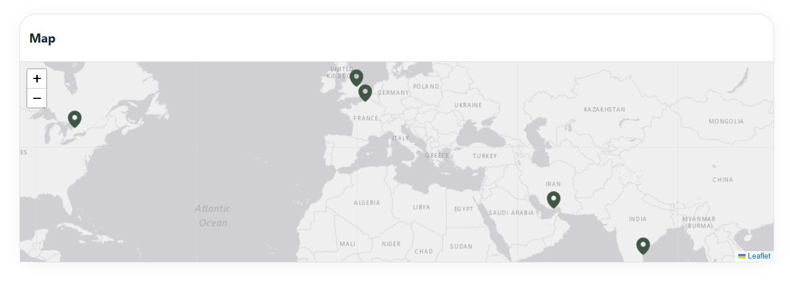

## Overview

The **Map Web Part** is a custom-built solution that helps you display multiple locations in an interactive and engaging way within SharePoint. It uses latitude and longitude to accurately plot locations on a dynamic map. Each location can include details like an image, full address, contact information, and a tour URL for a virtual experience. Overall, it transforms simple location data into a powerful visual tool, making it easier for users to explore and connect with locations directly from the intranet.

## Configuration

### Header Settings

📸 View Header Settings Screenshots

| Name                     | Purpose                                                          | Example / Options   |
| ------------------------ | ---------------------------------------------------------------- | ------------------- |
| Webpart Title            | Allows entering a custom title for the Webpart                   | Map                 |
| WebPart Title Text Color | Defines the title color using dropdown with site theming options | \#242424            |
| Preview                  | Displays theme preview                                           | Color Block Display |

- - -

### General Settings

📸 View General Settings Screenshots

| Name                     | Purpose                                                          | Example / Options   |
| ------------------------ | ---------------------------------------------------------------- | ------------------- |
| Select a List  | Choose which SharePoint list to display data from     |  “Location” |

- - -

### Map Plugin Settings

📸 View Map Plugin Settings Screenshots

| Name                     | Purpose                                                          | Example / Options   |
| ------------------------ | ---------------------------------------------------------------- | ------------------- |
| Default Latitude Position | sets the initial centre of the map when it loads | {Blank} |
|Default Longitude Position | sets the initial centre of the map when it loads | {Blank} |

