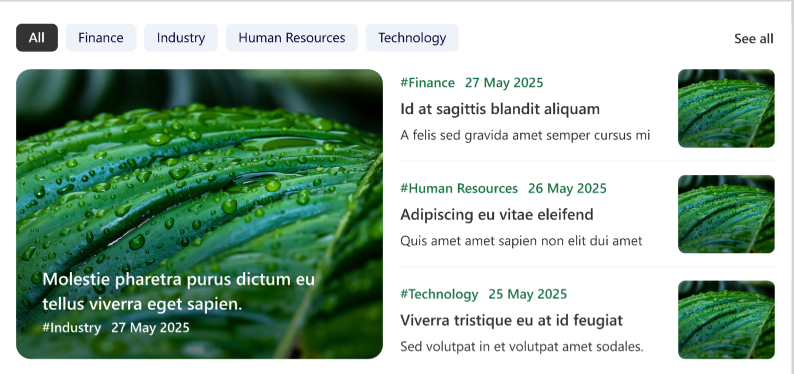
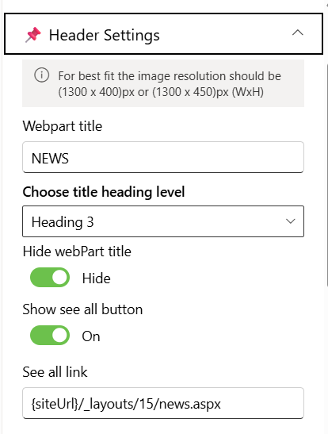
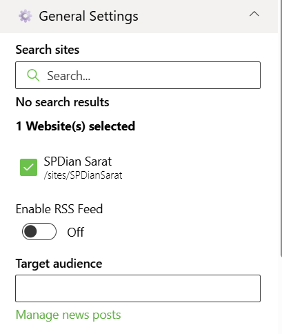
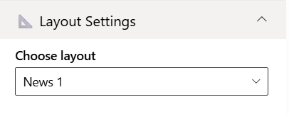
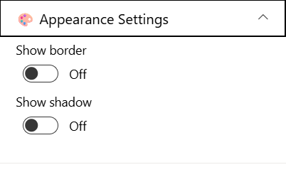

## Overview

This News web part showcases recent articles and events with eye-catching images and clear categorization by topics like Finance, Industry, HR, and Technology. Users can quickly browse and filter news items, keeping everyone informed and connected on the SharePoint site.

## Configuration

### Header Settings

📸 View Header Settings Screenshots

| Name                       | Purpose                                                   | Example / Options                 |
| -------------------------- | --------------------------------------------------------- | --------------------------------- |
| Webpart title              | Specify a title for the News Web Part.                    | “NEWS”                            |
| Choose title heading level | Select the heading level (H1–H6) for the Web Part title.  | Heading 3                         |
| Hide webpart title         | Toggle to show or hide the Web Part title.                | Show / Hide                       |
| Show see all button        | Display or hide the “See All” link for News navigation.   | Show / Hide                       |
| See all link               | Provide a URL for the “See All” button to redirect users. | `{siteUrl}/_layouts/15/news.aspx` |

- - -

### General Settings

📸 View General Settings Screenshots

| Name                | Purpose                                                              | Example / Options                         |
| ------------------- | -------------------------------------------------------------------- | ----------------------------------------- |
| Search sites        | Search the SharePoint sites source for the News.                     | SharePoint Sites available in the tenant. |
| Website(s) selected | Select the SharePoint sites source for the News.                     | Search results based upon the key search  |
| Enable RSS Feed     |                                                                      | On/Off                                    |
| Target audience     | Enter the person or group as a target audience for the News Web Part | People Picker                             |
| Manage news posts   | Create new News posts or update the existing news posts              | Link                                      |

- - -

#### Layout Settings

📸 View layout Configuration Screenshots

| Name          | Purpose                                | Example  |
| ------------- | -------------------------------------- | -------- |
| Choose layout | Choose the layout for the News Webpart | Dropdown |

- - -

### Appearance Settings

📸 View Appearance Settings Screenshots

| Name                     | Purpose                                                        | Example / Options           |
| ------------------------ | -------------------------------------------------------------- | --------------------------- |
| Show border           | Toggle to show or hide the border of the banner. | On/Off       |
| Show shadow           | Toggle to show or hide the shadow of the banner. | On/Off       |                  |
