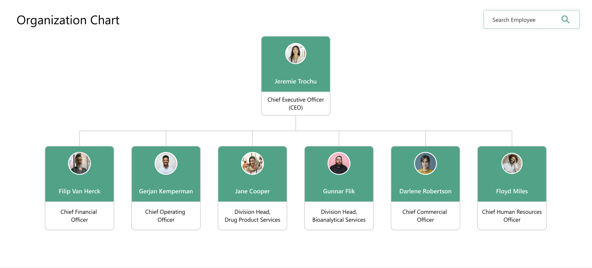
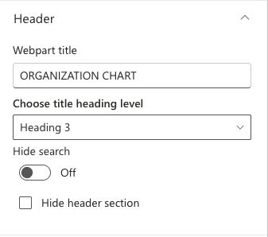
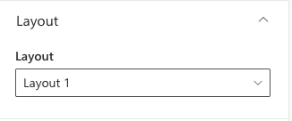
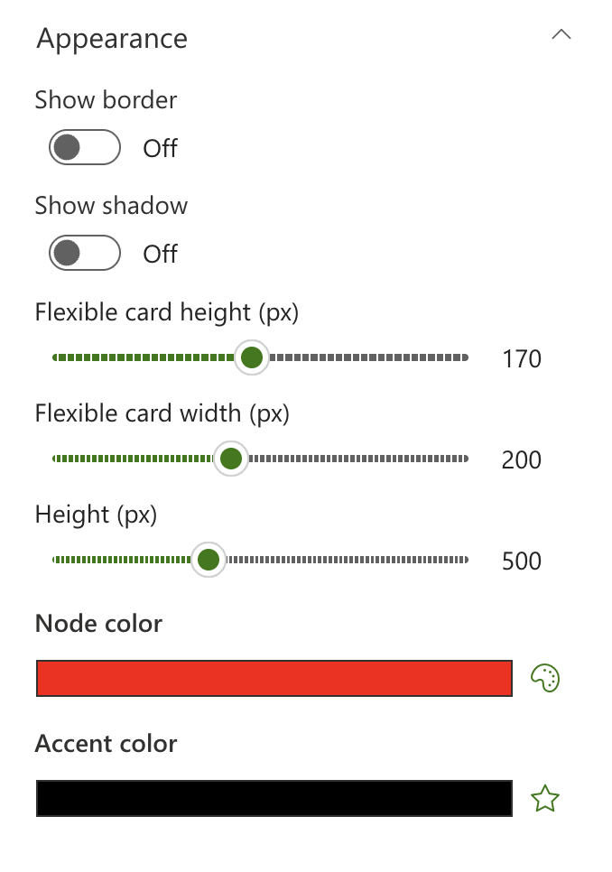

## Overview

This web part will display a chart showing the organizational structure of the company based on the selected SharePoint site or list. It uses the Microsoft Graph API to query the user profiles and build the hierarchy

## Configuration

#### Header

📸 View Header settings Screenshots

| Name                       | Purpose                                                                       | Example              |
| -------------------------- | ----------------------------------------------------------------------------- | -------------------- |
| Webpart title              | Display title of the webpart.                                                 | “Organization Chart” |
| Choose title heading level | Choose the heading level for the webpart title.                               | H1 / H2 / H3         |
| Hide search                | Toggle to enable or disable hiding the search functionality for the web part. | On/Off               |
| Hide header section        | Toggle to enable or disable hiding the header section for the web part.       | On/Off               |

#### Layout

📸 View layout Configuration Screenshots

| Name    | Purpose                                    | Example  |
| ------- | ------------------------------------------ | -------- |
| Layouts | Choose the layout for the welcome message. | Dropdown |

#### Appearance Settings

📸 View Appearance Settings Screenshots

| Name                  | Purpose                                          | Example      |
| --------------------- | ------------------------------------------------ | ------------ |
| Show border           | Toggle to show or hide the border of the banner. | On/Off       |
| Show Shadow           | Toggle to show or hide the shadow of the banner. | On/Off       |
| Rectangle card width  | Set the width of the user card.                  | Slider       |
| Rectangle card height | Set the height of the user card.                 | Slider       |
| Chart height          | Set the height of the chart area.                | Slider       |
| Node color          | Set the user card color for the web part.           | Color picker |
| Accent color          | Set the accent color for the web part.           | Color picker |
