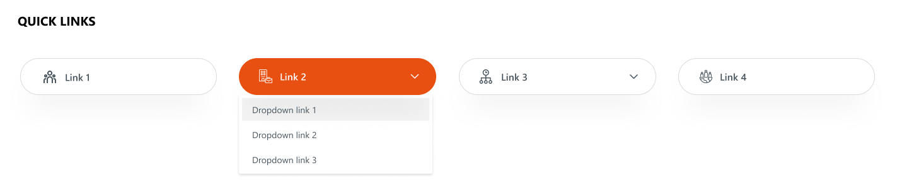
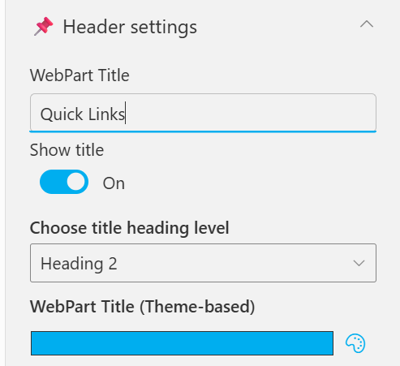
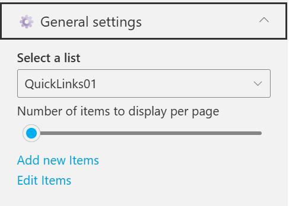
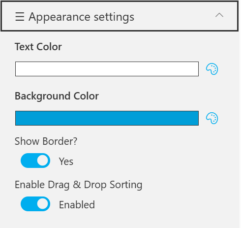

## Overview

An enhanced quick links layout where certain links include dropdowns for sub-links. It combines clean icons, rounded button styling, and contextual navigation options.
This format supports hierarchical navigation, making it suitable for displaying grouped or related quick links.

## Configuration

### Header settings

📸 View Header Settings Screenshots

| Name                        | Purpose                                                 | Example / Options |
| --------------------------- | ------------------------------------------------------- | ----------------- |
| WebPart Title               | Specify a title for the Quick Links Web Part.           | “Quick Links”     |
| Choose title heading level  | Select the heading level (H1–H6) for the WebPart title. | Heading 3         |
| Hide WebPart Title          | Toggle to show or hide the WebPart title.               | Show / Hide       |
| WebPart Title (Theme-based) | Set a theme-based title color or style for the WebPart. | Color Picker      |

- - -

### General settings

📸 View General Settings Screenshots

| Name                                | Purpose                                                       | Example / Options    |
| ----------------------------------- | ------------------------------------------------------------- | -------------------- |
| Select List                         | Choose which SharePoint list to display data from.            | QuickLinks           |
| Number of items to display per page | Define the maximum number of quick links to display per page. | Slider (e.g., 3)     |
| Add New Items                       | Shortcut to add new list items directly.                      | Link (Add New Items) |
| Edit Items                          | Opens the selected list to modify existing entries            | Link (Edit Items)    |

- - -

### Appearance settings

📸 View Appearance Settings Screenshots

| Name                       | Purpose                                                  | Example / Options   |
| -------------------------- | -------------------------------------------------------- | ------------------- |
| Text Color                 | Set the text color for items or labels in the web part.  | Color Picker(White) |
| Background Color           | Choose a background color for the section or item area.  | Color Picker (Blue) |
| Show Banner                | Display a banner background behind the title.            | Checkbox            |
| Show Border?               | Toggle the border visibility for the displayed items.    | Yes / No            |
| Enable Drag & Drop Sorting | Allow users to reorder items within the web part easily. | Enabled / Disabled  |
