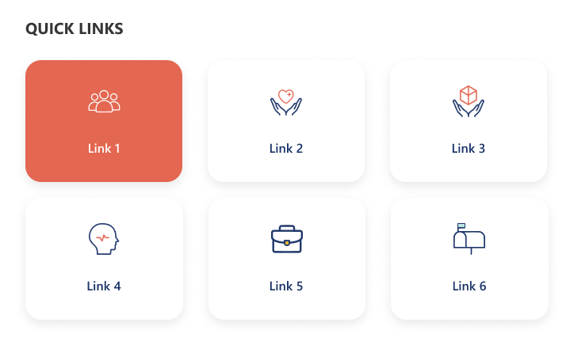
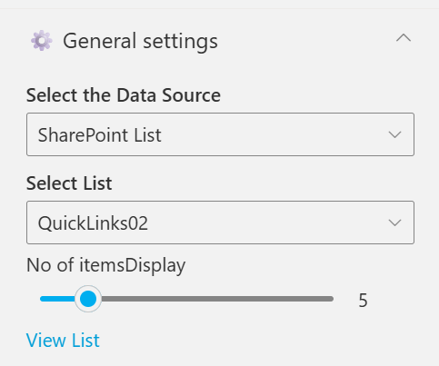

## Overview

A minimal grid-style quick links design showcasing key resources with large icon buttons. The selected link is highlighted with a color accent for visual focus.
It provides a clean and compact view ideal for quick navigation and content discovery.

## Configuration

### Header settings

📸 View Header Settings Screenshots

| Name                        | Purpose                                                 | Example / Options |
| --------------------------- | ------------------------------------------------------- | ----------------- |
| WebPart Title               | Specify a title for the Quick Links Web Part.           | “Quick Links”     |
| Choose title heading level  | Select the heading level (H1–H6) for the WebPart title. | Heading 3         |
| Hide WebPart Title          | Toggle to show or hide the WebPart title.               | Show / Hide       |
| WebPart Title (Theme-based) | Set a theme-based title color or style for the WebPart. | Color Picker      |

- - -

### General settings

📸 View General Settings Screenshots

| Name                   | Purpose                                                                                                           | Example / Options |
| ---------------------- | ----------------------------------------------------------------------------------------------------------------- | ----------------- |
| Select the Data Source | Choose the data source type for fetching list items. \[Sharepoint List, Collection Data, Data Collect from Panel] | SharePoint List   |
| Select List            | Choose which SharePoint list to display data from                                                                 | QuickLinks02      |
| No of itemsDisplay     | Control how many items should be displayed in the section.                                                        | Slider (e.g., 6)  |
| View List              | Open the SharePoint list directly in a new tab.                                                                   | Link (View List)  |

- - -

### Appearance settings

📸 View Appearance Settings Screenshots

| Name                       | Purpose                                                  | Example / Options   |
| -------------------------- | -------------------------------------------------------- | ------------------- |
| Text Color                 | Set the text color for items or labels in the web part.  | Color Picker(White) |
| Background Color           | Choose a background color for the section or item area.  | Color Picker (Blue) |
| Show Banner                | Display a banner background behind the title.            | Checkbox            |
| Show Border?               | Toggle the border visibility for the displayed items.    | Yes / No            |
| Enable Drag & Drop Sorting | Allow users to reorder items within the web part easily. | Enabled / Disabled  |
