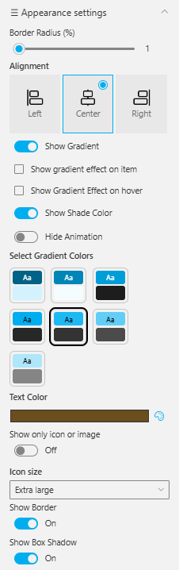

## Overview

A minimal grid-style quick links design showcasing key resources with large icon buttons. The selected link is highlighted with a color accent for visual focus.
It provides a clean and compact view ideal for quick navigation and content discovery.

## Configuration

### Header settings

📸 View Header Settings Screenshots

| Name                        | Purpose                                                 | Example / Options |
| --------------------------- | ------------------------------------------------------- | ----------------- |
| WebPart Title               | Specify a title for the Quick Links Web Part.           | “Quick Links”     |
| Choose title heading level  | Select the heading level (H1–H6) for the WebPart title. | Heading 3         |
| Hide WebPart Title          | Toggle to show or hide the WebPart title.               | Show / Hide       |
| WebPart Title (Theme-based) | Set a theme-based title color or style for the WebPart. | Color Picker      |

- - -

### General settings

📸 View General Settings Screenshots

| Name                   | Purpose                                                                                                           | Example / Options |
| ---------------------- | ----------------------------------------------------------------------------------------------------------------- | ----------------- |
| Select the Data Source | Choose the data source type for fetching list items. \[Sharepoint List, Collection Data, Data Collect from Panel] | SharePoint List   |
| Select List            | Choose which SharePoint list to display data from                                                                 | QuickLinks02      |
| No of itemsDisplay     | Control how many items should be displayed in the section.                                                        | Slider (e.g., 6)  |
| View List              | Open the SharePoint list directly in a new tab.                                                                   | Link (View List)  |

- - -

### Appearance settings

📸 View Appearance Settings Screenshots

| Name                          | Purpose                                                                 | Example / Options                       |
| ----------------------------- | ----------------------------------------------------------------------- | --------------------------------------- |
| Border Radius (%)             | Adjusts the roundness of corners for items.                            | Slider (1%)                             |
| Alignment                     | Sets the alignment of content.                                         | Left / Center / Right                   |
| Show Gradient                 | Enables gradient background for items.                                 | On / Off                                |
| Show Gradient Effect on Item  | Applies gradient only to selected items.                               | Checkbox                                |
| Show Gradient Effect on Hover | Displays gradient when hovering over items.                            | Checkbox                                |
| Show Shade Color              | Adds a shading overlay for depth.                                      | On / Off                                |
| Hide Animation                | Disables animations for a static appearance.                           | Toggle                                  |
| Select Gradient Colors        | Choose color pairs for gradient effects.                               | Multiple preset swatches                |
| Text Color                    | Sets the color of text elements.                                       | Color Picker (Brown)                    |
| Show Only Icon or Image       | Displays only icons or images without text.                            | On / Off                                |
| Icon Size                     | Adjusts icon size within the web part.                                 | Extra large                             |
| Show Border                   | Toggles border visibility around elements.                             | On / Off                                |
| Show Box Shadow               | Adds or removes a shadow behind boxes or items.                        | On / Off                                |
