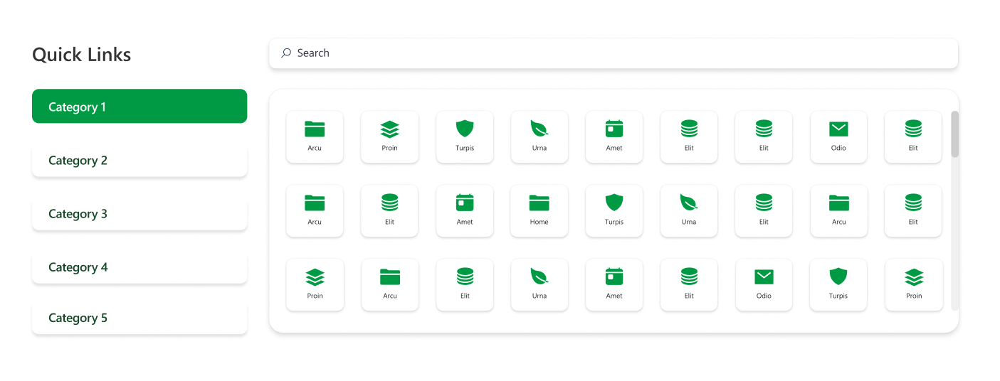
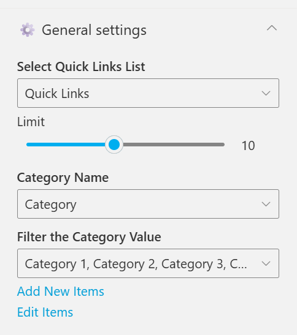
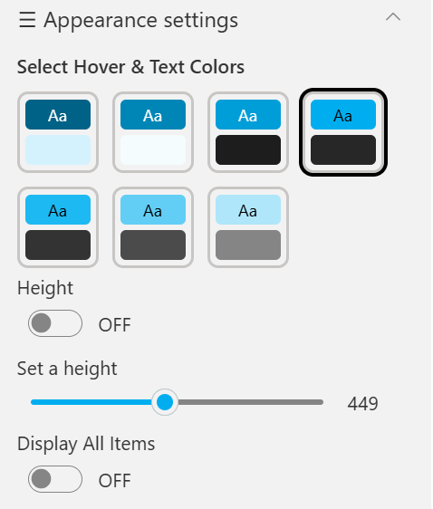

## Overview

An enhanced quick links layout where certain links include dropdowns for sub-links. It combines clean icons, rounded button styling, and contextual navigation options.
This format supports hierarchical navigation, making it suitable for displaying grouped or related quick links.

## Configuration

### Header settings

📸 View Header Settings Screenshots

| Name                        | Purpose                                                 | Example / Options |
| --------------------------- | ------------------------------------------------------- | ----------------- |
| WebPart Title               | Specify a title for the Quick Links Web Part.           | “Quick Links”     |
| Choose title heading level  | Select the heading level (H1–H6) for the WebPart title. | Heading 3         |
| Hide WebPart Title          | Toggle to show or hide the WebPart title.               | Show / Hide       |
| WebPart Title (Theme-based) | Set a theme-based title color or style for the WebPart. | Color Picker      |

- - -

### General settings

📸 View General Settings Screenshots

| Name                      | Purpose                                                       | Example / Options                       |
| ------------------------- | ------------------------------------------------------------- | --------------------------------------- |
| Select Quick Links List   | Select the list containing the quick link items.              | Quick Links                             |
| Limit                     | Define the maximum number of quick links to display per page. | Slider (e.g., 10)                       |
| Category Name             | Choose which list column will be used for categorization.     | Category                                |
| Filter the Category Value | Select category values to filter the displayed quick links.   | Category 1, Category 2, Category 3, etc |
| Add New Items             | Shortcut to add new list items directly.                      | Link (Add New Items)                    |
| Edit Items                | Opens the selected list to modify existing entries            | Link (Edit Items)                       |

- - -

### Appearance settings

📸 View Appearance Settings Screenshots

| Name                     | Purpose                                                          | Example / Options           |
| ------------------------ | ---------------------------------------------------------------- | --------------------------- |
| Select Hover & Text Colors | Pick a preset combination of hover and text colors.              | Color Tile Presets (6 Options) |
| Height                   | Toggle to set a fixed height for the web part section.            | ON / OFF                    |
| Set a height             | Adjust the height using a slider when enabled.                    | Slider (e.g., 449)          |
| Display All Items        | Show all items regardless of filtering or limit.                  | ON / OFF                    |
