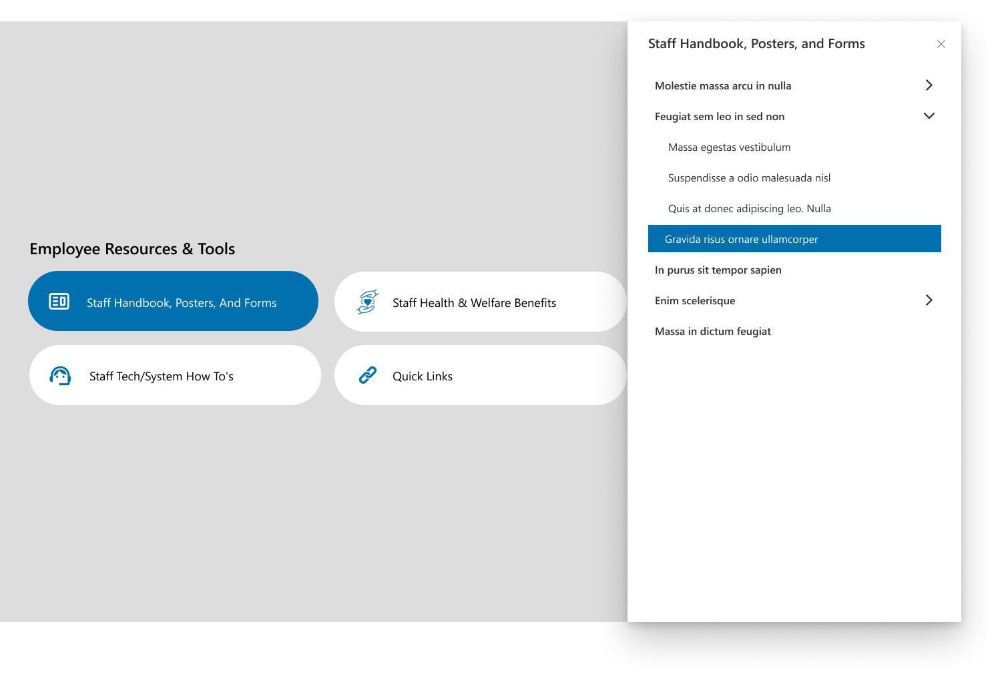
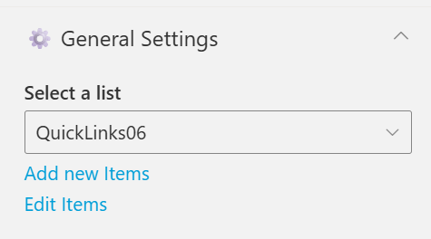
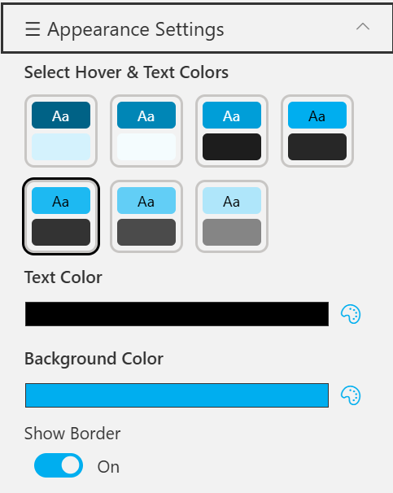

## Overview

This layout presents categorized employee resources such as staff handbooks, welfare benefits, and system guides. It uses a modern tile design with smooth navigation to detailed document sections.
The interface ensures quick access to essential staff materials through an intuitive button-based layout.

## Configuration

### Header settings

📸 View Header Settings Screenshots

| Name                        | Purpose                                                 | Example / Options |
| --------------------------- | ------------------------------------------------------- | ----------------- |
| WebPart Title               | Specify a title for the Quick Links Web Part.           | “Quick Links”     |
| Choose title heading level  | Select the heading level (H1–H6) for the WebPart title. | Heading 3         |
| Hide WebPart Title          | Toggle to show or hide the WebPart title.               | Show / Hide       |
| WebPart Title (Theme-based) | Set a theme-based title color or style for the WebPart. | Color Picker      |

- - -

### General settings

📸 View General Settings Screenshots

| Name          | Purpose                                            | Example / Options    |
| ------------- | -------------------------------------------------- | -------------------- |
| Select List   | Choose which SharePoint list to display data from. | Quick Links          |
| Add New Items | Shortcut to add new list items directly.           | Link (Add New Items) |
| Edit Items    | Opens the selected list to modify existing entries | Link (Edit Items)    |

- - -

### Appearance settings

📸 View Appearance Settings Screenshots

| Name                       | Purpose                                               | Example / Options    |
| -------------------------- | ----------------------------------------------------- | -------------------- |
| Select Hover & Text Colors | Choose from preset hover and text color combinations. | 6 Style Options      |
| Text Color                 | Define the text color used in the quick link tiles.   | Color Picker (Black) |
| Background Color           | Set the background color for tiles or web part area.  | Color Picker (Blue)  |
| Show Border                | Toggle the border visibility around each item.        | On / Off             |
