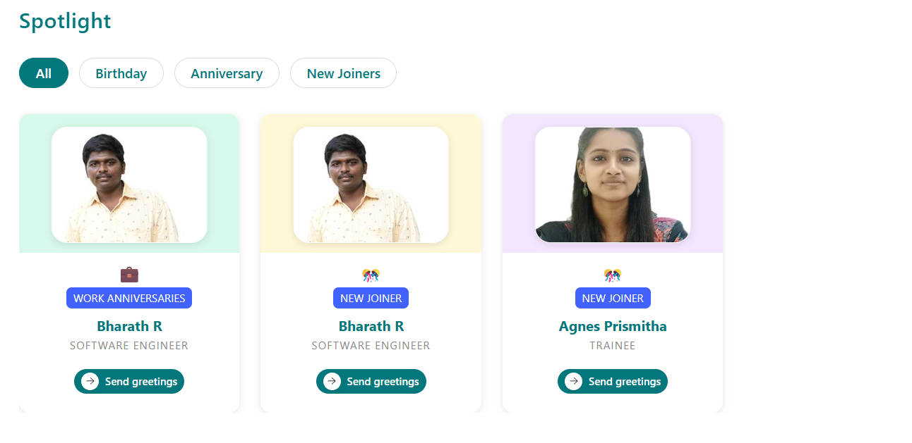
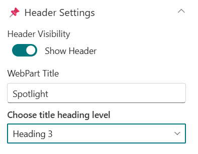
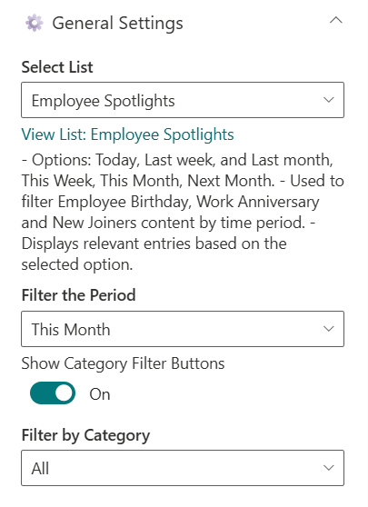
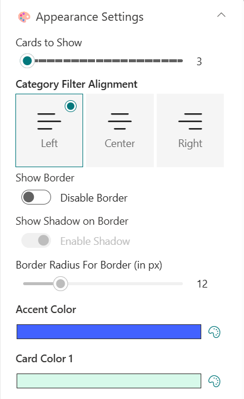
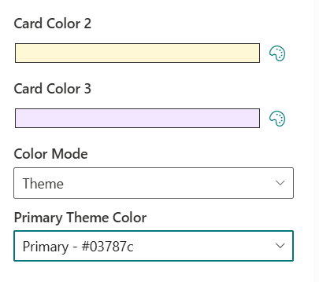
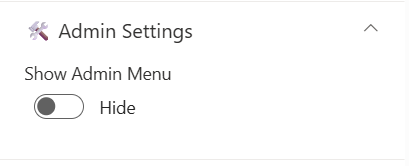
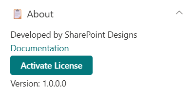

## Overview

This web part highlights upcoming Birthdays, Work Anniversaries, and New Joiners from your organization, using data stored in a SharePoint list. Users can quickly browse employee milestones and send greetings with ease. It provides an engaging, celebratory experience that keeps your team connected and informed.

## Configuration

### Header Settings

📸 View Header Settings Screenshots

| Name                       | Purpose                                                 | Example / Options       |
| -------------------------- | ------------------------------------------------------- | ----------------------- |
| Header Visibility          | Toggle to show or hide the Web Part title               | Show Header/Hide Header |
| WebPart Title              | Specify a title for the Spotlight Web Part.             | “Spotlight”             |
| Choose title heading level | Select the heading level (H1–H4) for the WebPart title. | Heading 3               |

- - -

### General Settings

📸 View General Settings Screenshots

| Name                         | Purpose                                            | Example / Options   |
| ---------------------------- | -------------------------------------------------- | ------------------- |
| Select List                  | Choose which SharePoint list to display data from. | Employee Spotlights |
| Filter the Period            | Select a filter period for displaying data         | Dropdown            |
| Show Category Filter Buttons | Toggle to show category filter                     | On/Off              |
| Filter by Category           | To display a particular category alone.            | Dropdown            |

- - -

### Apperanace Settings

📸 View Appearance Settings Screenshots

### Admin Settings

📸 View Admin Settings Screenshots

| Name            | Purpose                               | Example/Options |
| --------------- | ------------------------------------- | --------------- |
| Show Admin Menu | Toggle to show or hide the Admin Menu | Show/Hide       |

### About

📸 View About Screenshots

| Name                   | Purpose                                                           |
| ---------------------- | ----------------------------------------------------------------- |
| **Developer Info**     | Indicates the web part is built by **SharePoint Designs**.        |
| **Documentation Link** | Links to this documentation for easy reference.                   |
| **Activate License**   | Button to activate the licensed or premium version if applicable. |
