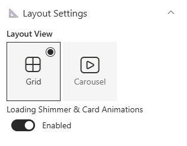
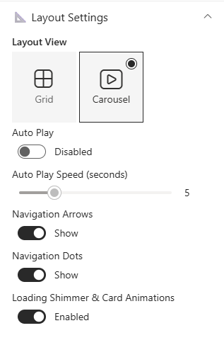

## Overview

This web part highlights upcoming Birthdays, Work Anniversaries, and New Joiners from your organization, using data stored in a SharePoint list. Users can quickly browse employee milestones and send greetings with ease. It provides an engaging, celebratory experience that keeps your team connected and informed.

## Configuration

### Header Settings

📸 View Header Settings Screenshots

| Name                       | Purpose                                                 | Example / Options       |
| -------------------------- | ------------------------------------------------------- | ----------------------- |
| Header Visibility          | Toggle to show or hide the Web Part title               | Show Header/Hide Header |
| WebPart Title              | Specify a title for the Spotlight Web Part.             | “Spotlight”             |
| Choose title heading level | Select the heading level (H1–H4) for the WebPart title. | Heading 3               |

- - -

### General Settings

📸 View General Settings Screenshots

| Name                         | Purpose                                            | Example / Options   |
| ---------------------------- | -------------------------------------------------- | ------------------- |
| Select List                  | Choose which SharePoint list to display data from. | Employee Spotlights |
| Filter the Period            | Select a filter period for displaying data         | Dropdown            |
| Show Category Filter Buttons | Toggle to show category filter                     | On/Off              |
| Filter by Category           | To display a particular category alone.            | Dropdown            |
| Event Categories             | Collection Data to add new Category                | Collection Data     |

- - -

### Layout Settings

📸 View Layout Settings Screenshots

| Name | Purpose | Example / Options |
| ---- | ------- | ----------------- |
| Layout View | To display cards in two layouts | Grid/ Carousel |
| Loading Shimmer & Card Animations | Toggle to Show Shimmer & Animations on card loading | Enabled/Disabled |
| Auto Play | Toggle to autoplay the carousel | Enabled/Disabled |
| Auto Play Speed (seconds) | Slider to control the speed of the autoplay | Slider |
| Navigation Arrows | Toggle to show/hide the navigation arrows | On/Off |
| Navigation Dots | Toggle to show/hide the navigation dots | On/Off |

- - -

### Apperanace Settings

📸 View Appearance Settings Screenshots

| Name                             | Purpose                                                                            | Example/Options     |
| -------------------------------- | ---------------------------------------------------------------------------------- | ------------------- |
| Cards to Show                    | Adjust the Slider to show number of cards to be displayed                          | Slider              |
| Category Filter Alignment        | Select the desired alignment for the filter category                               | Choice              |
| Show Border                      | Toggle to show or hide the border                                                  | On/Off              |
| Show Shadow on Border            | Toggle to show or hide the shadow for border                                       | On/Off              |
| Border Radius For Border (in px) | Adjusts the roundness of corners for items.                                        | Slider(8px to 25px) |
| Accent Color                     | Choose the background color applied to the category tag on the card                | Color Picker        |
| Card Color 1                     | Choose the bacckground color applied on the first card                             | Color Picker        |
| Card Color 2                     | Choose the bacckground color applied on the second card                            | Color Picker        |
| Card Color 3                     | Choose the bacckground color applied on the third card                             | Color Picker        |
| Color Mode                       | Select the color mode for Send Greetings button and Category                       | Dropdown            |
| Theme Color                      | Select the theme color to be applied for Send Greetings button and category button | Dropdown            |

- - -

### Admin Settings

📸 View Admin Settings Screenshots

| Name            | Purpose                               | Example/Options |
| --------------- | ------------------------------------- | --------------- |
| Show Admin Menu | Toggle to show or hide the Admin Menu | Show/Hide       |

- - -

### About

📸 View About Screenshots

| Name                   | Purpose                                                           |
| ---------------------- | ----------------------------------------------------------------- |
| **Developer Info**     | Indicates the web part is built by **SharePoint Designs**.        |
| **Documentation Link** | Links to this documentation for easy reference.                   |
| **Activate License**   | Button to activate the licensed or premium version if applicable. |

- - -
