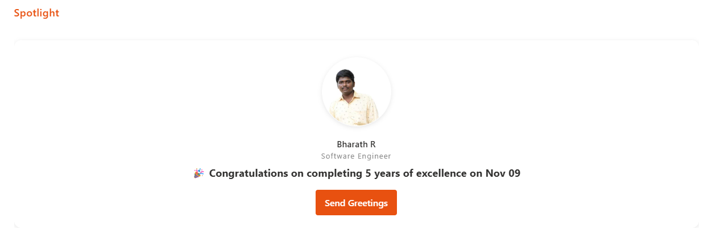
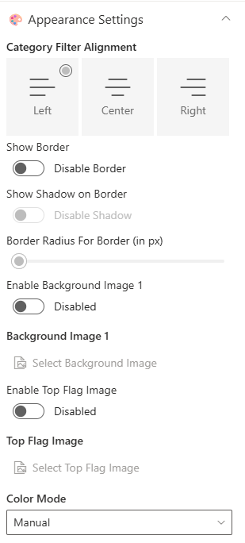
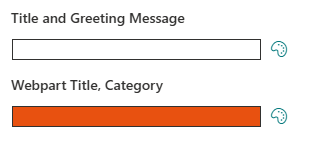
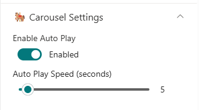

## Overview

This web part highlights upcoming Birthdays, Work Anniversaries, and New Joiners from your organization, using data stored in a SharePoint list. Users can quickly browse employee milestones and send greetings with ease. It provides an engaging, celebratory experience that keeps your team connected and informed.

## Configuration

### Header Settings

📸 View Header Settings Screenshots

| Name                       | Purpose                                                 | Example / Options       |
| -------------------------- | ------------------------------------------------------- | ----------------------- |
| Header Visibility          | Toggle to show or hide the Web Part title               | Show Header/Hide Header |
| WebPart Title              | Specify a title for the Spotlight Web Part.             | “Spotlight”             |
| Choose title heading level | Select the heading level (H1–H4) for the WebPart title. | Heading 3               |

- - -
### General Settings

📸 View General Settings Screenshots

| Name                         | Purpose                                            | Example / Options   |
| ---------------------------- | -------------------------------------------------- | ------------------- |
| Select List                  | Choose which SharePoint list to display data from. | Employee Spotlights |
| Filter the Period            | Select a filter period for displaying data         | Dropdown            |
| Show Category Filter Buttons | Toggle to show category filter                     | On/Off              |
| Filter by Category           | To display a particular category alone.            | Dropdown            |

---
### Appearance Settings

📸 View Appearance Settings Screenshots

| Name                                              | Purpose                                              | Example/Options     |
| ------------------------------------------------- | ---------------------------------------------------- | ------------------- |
| Category Filter Alignment                         | Select the desired alignment for the filter category | Choice              |
| Show Border                                       | Toggle to show or hide the border                    | On/Off              |
| Show Shadow on Border                             | Toggle to show or hide the shadow for border         | On/Off              |
| Border Radius For Border (in px)                  | Adjusts the roundness of corners for items.          | Slider(8px to 25px) |
| Enable Background Image 1                         | Toggle to show or hide the Background Image          | Enabled/Disabled    |
| Background Image 1                                | Upload a custom background image                     | Image Picker        |
| Enable Top Flag Image                             | Toggle to show or hide the Top Flag Image            | Enabled/Disabled    |
| Top Flag Image                                    | Upload a custom top flag image                       | Image Picker        |
| Color Mode                                        | Select the color mode for background gradient        | Dropdown            |
| Gradient Color                                    | Select the gradient color for background             | Color Picker        |
| Gradient Variant                                  | Select the gradient variant for background           | Dropdown            |
| Elements Color (Title, Category, Profile, Button) | Select the gradient color for elements               | Color Picker        |
| Elements Variant                                  | Select the gradient variant for elements             | Dropdown            |

---
### Carousel Settings

📸 View Carousel Settings Screenshots

| Name            | Purpose                               | Example/Options |
| --------------- | ------------------------------------------- | ----------------------------- |
| Enable Auto Play | Toggle to enable or disable the autoplay in carousel | Enabled/Disabled  |
| Auto Play Speed (seconds) | Adjust the Slider to control the speed of autoplay in carousel | Slider |

---
### Admin Settings

📸 View Admin Settings Screenshots

| Name            | Purpose                               | Example/Options |
| --------------- | ------------------------------------- | --------------- |
| Show Admin Menu | Toggle to show or hide the Admin Menu | Show/Hide       |

---
### About

📸 View About Screenshots

| Name                   | Purpose                                                           |
| ---------------------- | ----------------------------------------------------------------- |
| **Developer Info**     | Indicates the web part is built by **SharePoint Designs**.        |
| **Documentation Link** | Links to this documentation for easy reference.                   |
| **Activate License**   | Button to activate the licensed or premium version if applicable. |

---
