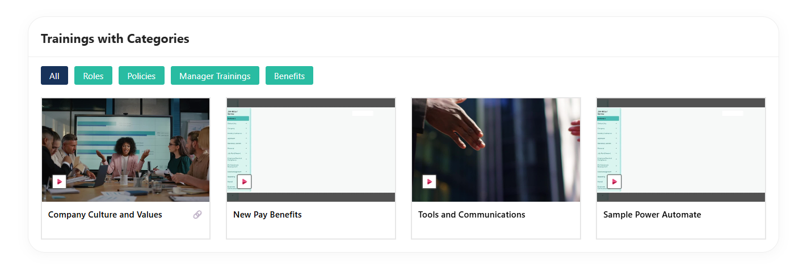
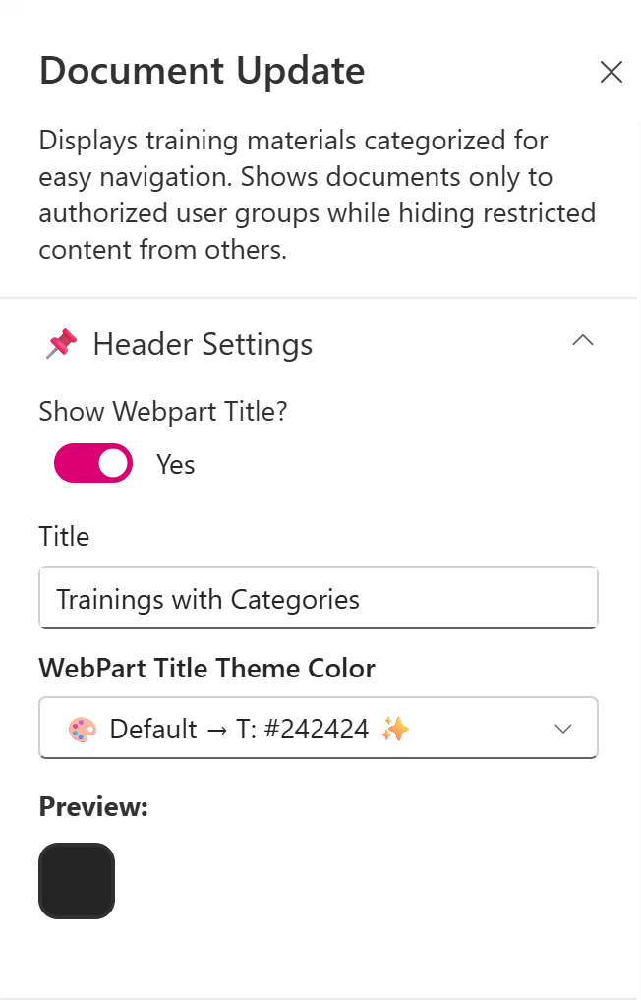
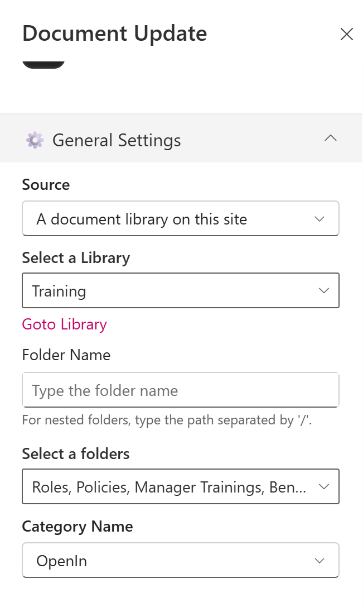
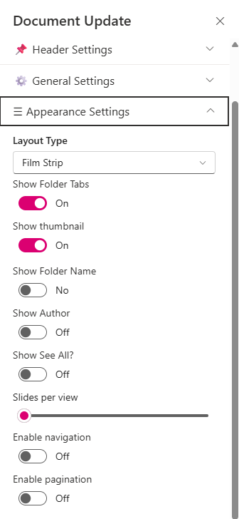
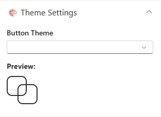
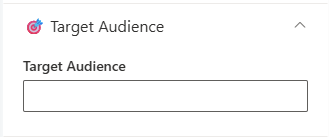
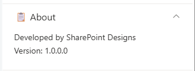

## Overview

The **Training Web Part with Categories** is an enhanced, custom-built solution designed to transform how training content is managed and consumed within SharePoint.
Previously, the web part functioned as a simple document viewer, where training materials were uploaded to a document library and displayed as a flat list. While functional, it lacked structure, flexibility, and an engaging user experience.
With this upgrade, the web part evolves into **a well-structured and interactive training hub.**

## Configuration

### Header Settings

📸 View Header Settings Screenshots

| Name                     | Purpose                                                           | Example / Options          |
| ------------------------ | ----------------------------------------------------------------- | -------------------------- |
| Show WebPart Title?      | Toggle to show or hide the WebPart title in the layout           | Yes / No                   |
| Title                    | Allows entering a custom title for the WebPart                   | “Training with Categories” |
| WebPart Title Text Color | Defines the title color using dropdown with site themeing options | \#242424                   |
| Preview                  | Displays theme preview                                            | Color Block Display        |

- - -

### General settings

📸 View General Settings Screenshots

| Name                      | Purpose                                                 | Example / Options               |
| ------------------------- | ------------------------------------------------------- | ------------------------------- |
| Source                    | Source of the Document library                         | A document library on this site |
| Select a Library          | Choose a specific document library from the site       | Training                        |
| Folder Name               | Optional text input for specifying a sub-folder         | (Blank)                         |
| Select a folders          | Checkbox to show all folders                         | Checkbox Selection              |
| Category Name             | Select the metadata column used for category filtering | Category                        |
| Filter the Category Value | Choose one or more category values to filter items     | Choice 1, Choice 2, Choice 3    |

- - -

### Appearance Settings

📸 View Appearance Settings Screenshots

| Name              | Purpose                                     | Example / Options |
| ----------------- | ------------------------------------------- | ----------------- |
| Layout Type       | Controls how content is visually displayed  | Film Strip        |
| Show Folder Tabs  | Toggle to display the folder name preview   | On                |
| Show Thumbnail    | Toggle to display file previews             | On                |
| Show Folder Name  | Toggle to display folder names              | Off               |
| Show Author       | Toggle to show the file creator             | On                |
| Show See All ?    | Toggle to show/hide the see all             | Off               |
| Slides per View   | Number of items shown per slide             | 4                 |
| Enable Navigation | Toggle to enable left/right carousel arrows | Off               |
| Enable Pagination | Toggle to enable pagination controls        | Off               |

- - -

### Theme Settings

📸 View Theme Settings Screenshots

| Name         | Purpose                                                    | Example / Options   |
| ------------ | ---------------------------------------------------------- | ------------------- |
| Button Theme | Display the site branding theme color for folder tabs | Dropdown            |
| Preview      | Displays theme preview for folder tabs                     | Color Display Block |

- - -

### Target Audience

📸 View Audience Settings Screenshots

| Name            | Purpose                               | Example / Options |
| --------------- | ------------------------------------- | ----------------- |
| Target Audience | Choose the people to show the webpart | People Picker     |

- - -
### About

📸 View Audience Settings Screenshots

| Name                   | Purpose                                                           |
| ---------------------- | ----------------------------------------------------------------- |
| Developer Info     | Indicates the web part is built by **SharePoint Designs**        |
| Version   | Display the version number of the webpart |
