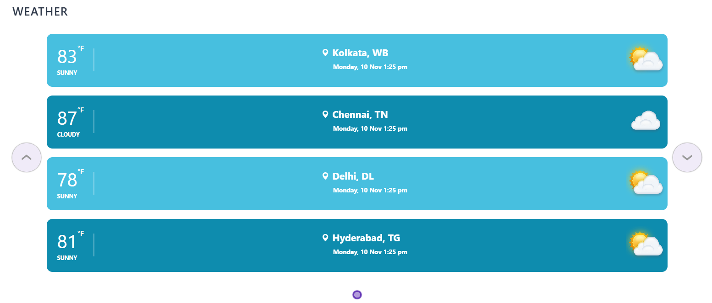
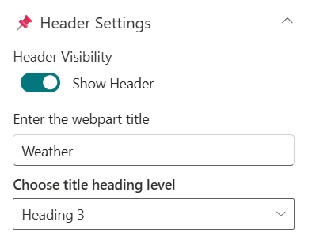
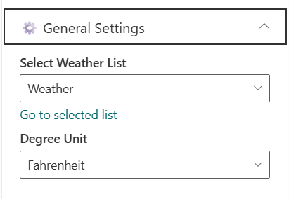
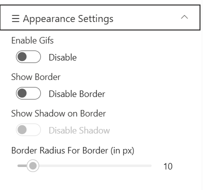

## Overview

This modern SharePoint web part provides weather updates for your organization's facilities or client locations worldwide.
Simply configure a SharePoint list with the locations you want to track, and the web part handles the rest.
It offers clear and accurate weather insights to help teams stay informed.

## Configuration

### Header Settings

| Name                       | Purpose                                                 | Example / Options       |
| -------------------------- | ------------------------------------------------------- | ----------------------- |
| Header Visibility          | Toggle to show or hide the Web Part title               | Show Header/Hide Header |
| Enter the webpart title    | Specify a title for the Weather Web Part.               | “Weather 01”            |
| Choose title heading level | Select the heading level (H1–H4) for the WebPart title. | Heading 3               |

### General Settings

| Name                | Purpose                                            | Example/Options  |
| ------------------- | -------------------------------------------------- | ---------------- |
| Select Weather List | Choose which SharePoint list to display data from. | Weather          |
| Degree Unit         | Choose the Degree Unit to show weather             | Dropdown (°F/°C) |

### Appearance Settings

| Name                             | Purpose                                      | Example/Options     |
| -------------------------------- | -------------------------------------------- | ------------------- |
| Enable Gifs                      | Toggle to show or hide the Gif's             | Enable/Disable      |
| Show Border                      | Toggle to show or hide the border            | Enable/Disable      |
| Show Shadow                      | Toggle to show or hide the shadow for border | Enable/Disable      |
| Border Radius For Border (in px) | Adjusts the roundness of corners for items.  | Slider(8px to 25px) |

### Usage Notes

* This Weather Webpart supports the live weather forecast of given locations in the list.
* Header Visibility is enabled by default. When toggled off, the Web Part Title and Heading Level options are hidden and no longer configurable.
* Border is disabled by default. When enabled, the Border Shadow and Border Radius options become available and depend on the Border setting.
